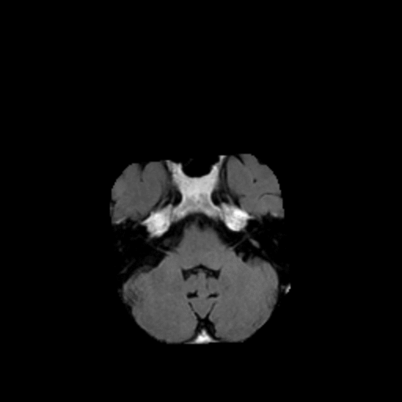
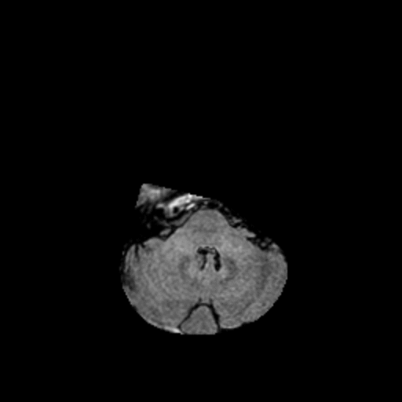
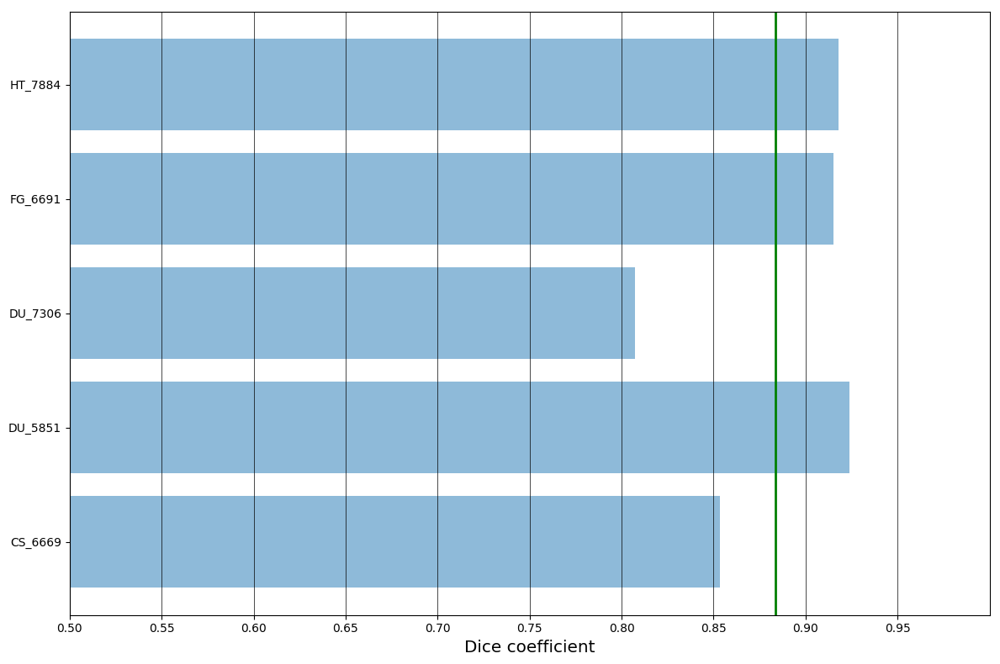

# FLAIR abnormality segmentation in brain MRI

This folder contains an implementation of a FLAIR abnormality segmentation in brain MRI using U-Net like architecture.
It can be used to preprocess MRI images, train the network for tumor segmentation or obtain segmentation predictions of  FLAIR abnormality in a custom dataset (not expected to work outstandingly well without prior fine-tuning).

### Results
The results presented here refer to the network fine-tuned for 64 epochs and initialized with the weights for skull stripping task based on FLAIR modality only.
This training procedure requires to have the same training/test split for both FLAIR segmentaiton and skull stripping tasks.
It was not used in the application described in our paper.
Still, it makes the developed architecture, trained weights, and code more widely applicable.

Some qualitative results for the worst (80.74% DSC) and best case (92.37% DSC) from the test set before postprocessing.
Blue outline corresponds to ground truth and red to automatic segmentation output.
Images show FLAIR modality after preprocessing and skull stripping.

| Worst Case | Best Case |
|:----------:|:---------:|
|||

The average Dice similarity coefficient (DSC) for this split was 88.37%.
The distribution of DCS is shown below.



Training log for a random 5 test cases split (the same as in skull stripping):


### Usage

#### Preprocessing
You need to have a folder with images preprocessed using provided matlab function `preprocessing3D.m`.
It rescales them to have spacial dimensions 256x256 and performs contrast normalization.
The preprocessing is done for a 3D volume of slices yet for each MRI modality separately.
Refer to the documentation of `preprocessing3D.m` function for more details.
The main requirement for the following steps is to have image names in format `<case_id>_<slice_number>.tif` and corresponding masks named `<case_id>_<slice_number>_mask.tif`.

#### Training
The training script `train.py` has variables defined at the top that you need to set:

- `train_images_path` - folder containing training images
- `valid_images_path` - folder containing validation images
    
Other variables can be changed to adjust some training parameters.
One of them, `init_weights_path`, allows to initialize the network with pre-trained weights, e.g. provided by us or from the model trained for skull stripping (in this case make sure to have the same training/test splits for both tasks).
The models described in our paper were trained from scratch.

Then, run the training using
```
python train.py
```

#### Testing
To run the inference, you need to set up some variables defined at the top of the `test.py` script:

- `weights_path` - path to the trained weights
- `train_images_path` - folder containing training images to compute the mean and standard deviation for data normalization; if you pass your own mean and standard deviation to the `test` function, this variable is not used
- `test_images_path` - folder with test images for prediction; it must contain corresponding mask files as well, however, they can be dummy (all zeros)
- `predictions_path` - folder for saving predicted and ground truth segmentation outlines (will be created if it doesn't exist)

When all variables are set up, run the inference using
```
python test.py
```

If you want to use our trained weights for inference, you should use mean and standard deviation values for normalization computed on our training set.
They are the default parameter values used in the `test` function of `test.py` script.

Trained weights can be downloaded using provided script
```
./download_weights.sh 
```

### Troubleshooting

#### AttributeError: 'module' object has no attribute 'rolling_count'

Try updating dask (related issue: [tflearn/issues/766](https://github.com/tflearn/tflearn/issues/766)):

```
sudo pip install dask --upgrade
```
